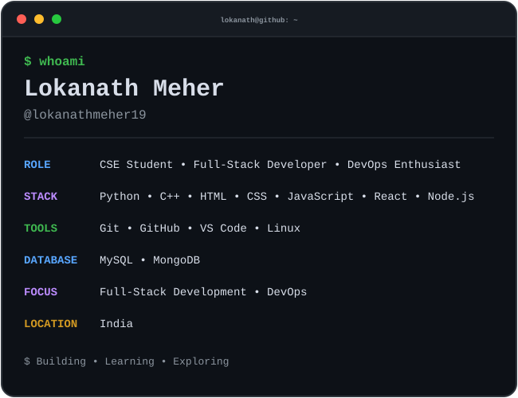
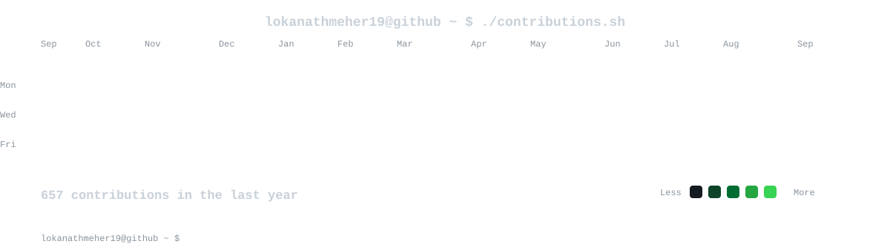

  

<!-- =========================================================
     PROFILE
     ========================================================= -->

<table width="100%" border="0" cellspacing="0" cellpadding="4">
<tr>

<td width="50%" align="center" valign="middle">

</td>

<td width="50%" align="center" valign="middle">

</td>

</tr>
</table>

 

<!-- =========================================================
     CONTRIBUTIONS
     ========================================================= -->

  

 

<!-- =========================================================
     TECH STACK
     ========================================================= -->

<h2 align="center">Tech Stack</h2>

 

<h2 align="center">Connect With Me</h2>

 
<!-- =========================================================
     FOOTER
     ========================================================= -->

  <code>lokanathmeher19@github ~ $ ./links.sh</code>

  <b>Building • Learning • Exploring</b>

